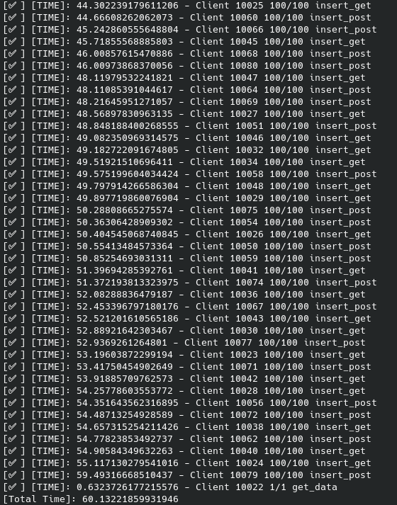

# Webserver

## Description

While the server is running, 2 calls to the API can be made:

    - Put data
    - Get data

The first can be done with a POST or GET request to the path `"/put_data"` and should have exactly 4 fields:

    - Latitude
    - Longitude
    - Speed
    - Time

The second call is done with a GET request to `/get_data` and returns a JSON string of the data currently stored in the server

## Tests

## To do

* [x] Handle multiple requests simultaneously (Does Flask do this by default?) 
* [x] Receive http requests with the following variables Latitude, Longitude, Speed, Time
* [x] Provide an api that returns all the data already received
* [x] API description (add more explicit stuff)
* [x] **Bonus**: add persistence
